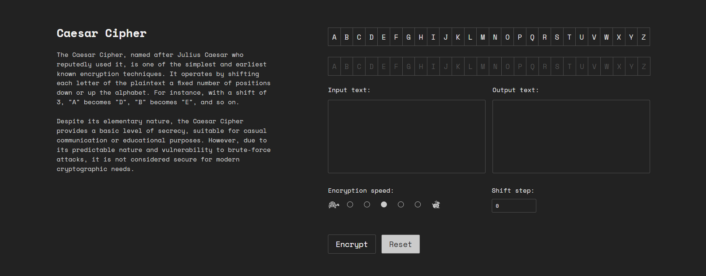
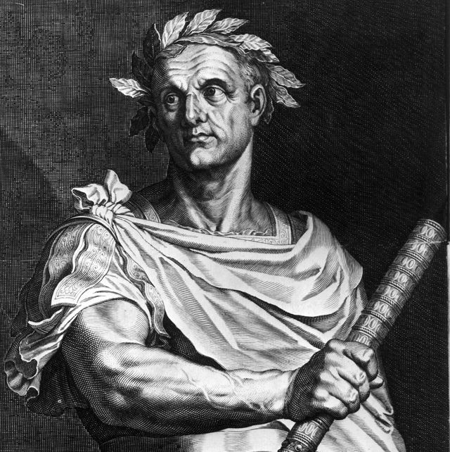
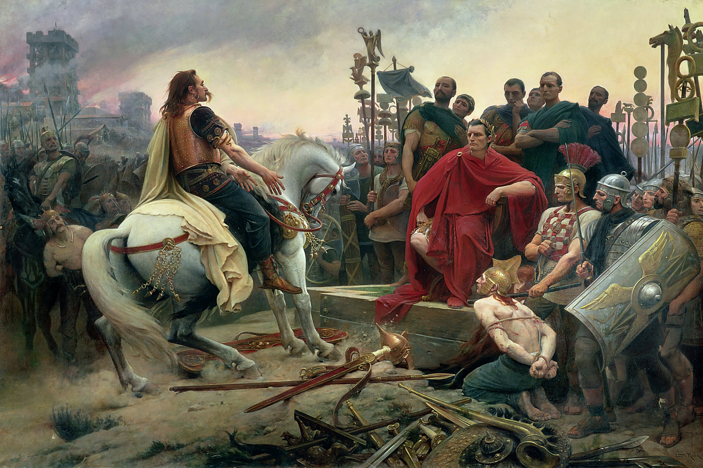

<div align ='center'>
    </img>
    <h3>Caesar Cipher</h3>
    <p align = 'center'>
        <a href='https://caesar-cipher-gkeb.onrender.com/'>View Demo</a>
        |
        <a href='https://github.com/bachvo01/Caesar-Cipher/issues'>Report Bugs</a>
        |
        <a href='https://github.com/bachvo01/Caesar-Cipher/issues'>Request Features</a>
    </p>
</div>

## About
<div align ='center'>
    </img>
</div>&ensp;

A Caesar cipher is a simple method of encoding messages. Caesar ciphers use a substitution method where letters in the alphabet are shifted by some fixed number of spaces to yield an encoding alphabet. 

A Caesar cipher with a shift of 
1
1 would encode an A as a B, an M as an N, and a Z as an A, and so on. The method is named after Roman leader Julius Caesar, who used it in his private correspondence.

This project is a visualisation of Caesar Cipher - one of the oldest cipher in the human history. The main goal is to provide users an intuitive vision of how the cipher works. &ensp;
<br></br>

<!--
## History

<div align = 'center'>
    </img>
    <div align ='center'>
    Julius Caesar, 12 July 100 BC – 15 March 44 BC
    </div>
</div>&ensp;

Developed around the year 45 BC, it was used by Julius Caesar to send secret messages to his generals in the field. In the event that one of his messages got intercepted, his opponent could not read them. This obviously gave him a great strategic advantage.

In Julius Caesar’s Gallic Wars, he describes how he sent a message to the besieged Cicero. The messsage was encrypted by substituting Greek letters for Roman letters, then delivered in the most dramatic way imaginable. The messenger, unable to reach the camp, hurled a spear with the letter fastened to it with a thong. Although the spear lodged itself in a tower, nobody spotted it for two days. Eventually, it was taken down and delivered to Cicero, who read out the vital news to the entire camp, bringing enormous joy to his troops. 


<div align ='center'>
    Gallic Wars, Gaul, 58–50 BC
</div>&ensp;
--> 

<!-- <div align ='center'>
    Gallic Wars, Gaul, 58–50 BC</img>
</div> -->

This was the first documented use of a substitution cipher for military purposes. Substitution ciphers, as the name suggests, encrypt messages by replacing the original characters with different characters. This is in contrast to a transposition cipher, in which the characters remain the same, but they are transposed or rearranged to create an anagram.

Caesar shifted each letter of his message three letters to the right to produce what could be called the ciphertext. <br></br>

## Purpose

There are many videos and tools available out there on the Internet; however, most of them (imo) are outdated. As a computer science student, I know the frustration that some people has while studying Cryptography. That is why I wanted make easy-to-use, straighforward, and intuitive visualisations of different types of cipher.

Caesar cipher happens to be an interesting choice as it as arguably the most recognizable and oldest cipher out there. Take it for a spin! <br></br>

## Built With
This section should list any major frameworks/libraries used to bootstrap the project. Here are a few examples.

- 
- 
- )<br></br>

## Getting Started
To set up the project, you may need to follow these simple steps in order to have the project up and running in your local computers. <br></br>

### Prequisites
Firstly, let's keep your Node Package Manager (npm) up to the latest version. 

```
npm install npm@latest -g
```

### Installation
1. Clone git repositories:
   <br></br>
    ```
    git clone https://github.com/bachvo01/Caesar-Cipher.git
    ```
2. Install dependenciess:
   <br></br>
   ```
   npm install
   ```
3. Run projecct:
   <br></br>
   ```
   npm run dev
   ```

<br></br>
## Acknowledgement
- The Father of the Fatherland: <a href = 'https://en.wikipedia.org/wiki/Julius_Caesar'>Julius Caesar</a>
- Shout out to <a href ='https://github.com/hirako2000'>Hirako</a> for giving me the inspiration to achieve this project!
- <a href='https://flexbox.malven.co/'>Malven's Flexbox Cheatsheet</a>
- <a href='https://grid.malven.co/'>Malven's Grid Cheatsheet</a>
- <a href='https://shields.io/'>Img Shield</a>
- <a href='https://react-icons.github.io/react-icons/search/'>React Icons</a>

<br></br>


## References
- https://en.wikipedia.org/wiki/Julius_Caesar
- https://en.wikipedia.org/wiki/Caesar_cipher
- https://brilliant.org/wiki/caesar-cipher/
- https://academic.oup.com/book/40641/chapter-abstract/348304993?redirectedFrom=fulltext


